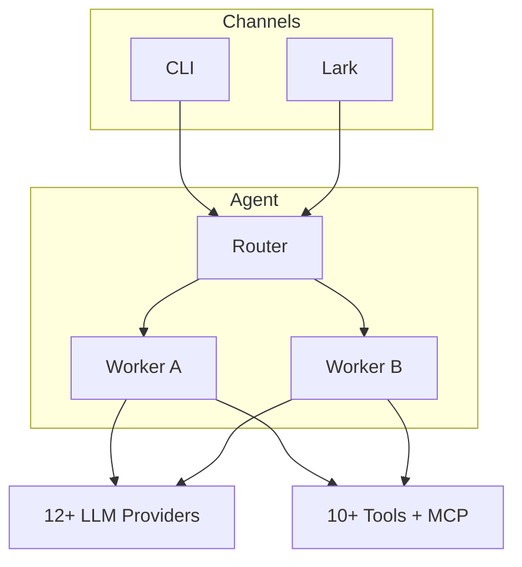

### Hi this is Tianle (DDX) 😄

[](https://www.linkedin.com/in/dai-t-11b6b0137/) [](https://x.com/ddx0510) [](https://discord.com/users/809306588267282433)


- Computer Science graduate from the National University of Singapore (Software development + game development)
- Fullstack Software Developer at [Platox.AI](https://www.ccmonet.ai/)
- Part-time Game Developer with [Turbo](https://turbo.computer/)

**Tech Stack:**

<table>
<tr>
<td><strong>💻 Frontend</strong></td>
<td>


</td>
</tr>
<tr>
<td><strong>⚙️ Backend</strong></td>
<td>


</td>
</tr>
<tr>
<td><strong>☁️ Cloud & DevOps</strong></td>
<td>


</td>
</tr>
<tr>
<td><strong>🎮 Game Dev</strong></td>
<td>


</td>
</tr>
</table>

---

## 🚀 Software Projects

### 🤖 nanobot-go - Lightweight Concurrent Team Agent

<table>
<tr>
<td width="50%" valign="top">

#### Architecture



</td>
<td width="50%" valign="top">

**A lightweight, concurrent team agent built in Go.** Inspired by [nanobot](https://github.com/HKUDS/nanobot).

~5,000 lines of Go. Single binary. No runtime dependencies. Built for the [CCMonet](https://ccmonet.dev) team.

**Features:**
- 🔀 **Concurrent Sessions**: Per-session goroutines with FIFO queuing
- 🧠 **LLM-Powered Memory**: Auto-consolidation into persistent knowledge base
- 🔧 **10+ Tools + MCP**: File ops, shell, web, API queries, sub-agents, cron
- 🔌 **12+ Providers**: Auto-detection from API key (OpenRouter, Gemini, Claude, etc.)
- 📋 **Markdown Skills**: Add capabilities without code changes
- 💬 **Multi-Channel**: CLI + Lark (Feishu) with @mention support

**Tech Stack:** Go | Cobra | robfig/cron | MCP Protocol

[**📂 View on GitHub**](https://github.com/ddx-510/nano-bot-go)

</td>
</tr>
</table>

### 🏢 OpenCode Pixel Office - AI Agent Visualizer

<table>
<tr>
<td width="50%" valign="top">

#### 📸 Screenshots


</td>
<td width="50%" valign="top">

**Watch your AI coding agents work in a retro pixel-art office!**

An OpenCode plugin that visualizes AI agent activity through a pixel-art office dashboard. Supports both OpenCode and Claude Code CLI with live WebSocket updates.

**Features:**
- 🎮 **Pixel Art Visualization**: Retro office showing agents working in real-time
- 🔀 **Dual CLI Support**: Works with OpenCode and Claude Code
- 📡 **Live WebSocket Updates**: Real-time agent activity streaming
- 📱 **Mobile-Responsive**: QR code connectivity for mobile viewing
- 🗂️ **Multi-Session Tracking**: Monitor agents across repositories

**Tech Stack:** React | PixiJS | Express.js | WebSocket | TypeScript

[**📂 View on GitHub**](https://github.com/ddx-510/opencode-pixel-office) | [**📦 npm**](https://www.npmjs.com/package/opencode-pixel-office)

</td>
</tr>
</table>

### 🖼️ React Multi Crop Image

<table>
<tr>
<td width="50%" valign="top">

#### 📸 Demo


</td>
<td width="50%" valign="top">

**A React component for drawing multiple crop regions on a single image.**

Originally built for document processing and receipt scanning at [cc:Monet](https://ccmonet.ai). Draw, resize, and export multiple crop areas as base64 — perfect for OCR, document processing, and image annotation workflows.

**Features:**
- ✂️ **Multi-Crop**: Draw and manage multiple crop regions on one image
- 📤 **Base64 Export**: Export cropped sections as data URLs
- 🎨 **Fully Customizable**: Style crop regions, icons, and interactions
- 📜 **Scroll-Aware**: Handles scrollable containers and hi-res images
- 🔷 **TypeScript**: Full type support

**Tech Stack:** React | TypeScript | Lodash

```bash
npm install react-multi-crop-image
```

[**📂 View on GitHub**](https://github.com/ddx-510/react-multi-crop-image) | [**📦 npm**](https://www.npmjs.com/package/react-multi-crop-image)

</td>
</tr>
</table>

### 📦 ddSideBar - Arc-Style Sidebar for Chrome

<table>
<tr>
<td width="50%" valign="top">

#### 📸 Screenshots

[](https://chromewebstore.google.com/detail/echdjophnbkljbokigbpknajhbjngeic)

</td>
<td width="50%" valign="top">

**Arc-Style Sidebar Extension** - Bring Arc browser's elegant sidebar experience to Chrome!

A Chrome extension that brings Arc browser's innovative tab and space management to Chrome. Organize your browsing with a beautiful, minimalist sidebar that puts your tabs and bookmarks at your fingertips.

**Features:**
- 🎨 **Arc-Style Sidebar**: Beautiful left sidebar with tabs list and glassmorphism effects
- 📑 **Tabs Management**: Quick tab switching, closing, and organization
- 🗂️ **Spaces Organization**: Create multiple spaces with custom names, icons, and colors
- 🔖 **Bookmarks Integration**: Two-layer system for bookmarks and tabs
- ⚙️ **Dual Mode Support**: Choose between Iframe injection or Chrome SidePanel
- 🔒 **Privacy First**: All data stored locally, nothing transmitted to external servers

**Tech Stack:** Chrome Extension Manifest V3 | Vanilla JavaScript | Modern CSS | Chrome APIs

[**📥 Install from Chrome Web Store**](https://chromewebstore.google.com/detail/echdjophnbkljbokigbpknajhbjngeic?utm_source=item-share-cb) | [**📂 View on GitHub**](https://github.com/ddx-510/dd-sidebar)

</td>
</tr>
</table>

### 🐟 Moyu (摸鱼) - Master the Art of Looking Busy

<table>
<tr>
<td width="50%" valign="top">

#### 📸 Screenshots

[](https://ddx-510.github.io/moyu-mac/)

</td>
<td width="50%" valign="top">

**The AI-powered productivity shield for remote workers.**

Take guilt-free breaks while your computer does the "work". Moyu (Chinese for "loafing") is a macOS menu bar application designed to help remote workers and developers take breaks while maintaining the appearance of productivity.

**Features:**
- 🛡️ **Productivity Shield**: Fake Update & Fake Coding screens to deter shoulder surfers
- 💰 **Value Your Time**: Money Counter & Paid Poop Tracker
- 🌊 **The Oasis**: Fish Pond gamification & soothing ocean theme
- 🚨 **Tide Warning**: Notification system for when managers approach

**Tech Stack:** Electron | React | TypeScript | Tailwind CSS

[**📥 Download**](https://ddx-510.github.io/moyu-mac/) | [**📂 View on GitHub**](https://github.com/ddx-510/moyu-mac)

</td>
</tr>
</table>

---

## 🎮 Game Projects

### 🐟 Fish Tank

<table>
<tr>
<td width="50%" valign="top">

#### 📸 Screenshots

[](https://ddx510.itch.io/fish-tank)
[](https://ddx510.itch.io/fish-tank)

<!-- Add more: [](https://ddx510.itch.io/fish-tank) -->

</td>
<td width="50%" valign="top">

**Interactive Digital Aquarium** - Create, customize, and interact with your own underwater world!

A relaxing, interactive aquarium game where you can design your own fish, watch them swim, and create a beautiful underwater ecosystem. 

**Features:**
- 🎨 **Custom Fish Creation**: Draw unique fish pixel-by-pixel with a built-in drawing tool
- 🏊 **Living Aquarium**: Watch fish swim naturally with realistic physics-based movement
- 🍽️ **Interactive Feeding**: Long-press to drop food and watch fish compete to eat
- 👥 **Social Features**: Vote on fish creations and track popularity
- 🖼️ **Gallery Mode**: Browse through the entire fish collection

**Tech Stack:** Turbo (Rust-based game engine) | Real-time multiplayer | Persistent storage

[**🎮 Play on itch.io**](https://ddx510.itch.io/fish-tank)

</td>
</tr>
</table>

---

### 🃏 Tok Pocket

<table>
<tr>
<td width="50%" valign="top">

#### 📸 Screenshots

[](https://ddx510.itch.io/tok-pocket)
[](https://ddx510.itch.io/tok-pocket)

</td>
<td width="50%" valign="top">

**Experience intense tactical card combat in this multiplayer strategy game!**

**Game Features:**

⚔️ **Strategic Grid-Based Combat**
- Deploy your cards on a 3x3 battlefield grid
- Plan your attacks and defenses with tactical positioning
- Master the art of card placement timing

🏗️ **Deep Deck Building System**
- Collect cards from multiple factions: Royal, Barbarian, and Undead
- Build and customize your perfect 30-card deck
- Unlock new cards through booster packs

🌐 **Multiplayer Battles**
- Challenge players online in real-time matches

**Tech Stack:** Turbo (Rust-based game engine) | Real-time multiplayer

[**🎮 Play on itch.io <password: turbo>**](https://ddx510.itch.io/tok-pocket) 

</td>
</tr>
</table>

---

## 🛠️ Tools Vibed

### 🔁 D-Decode - Sci-Tech File Converter

<table>
<tr>
<td width="50%" valign="top">

#### 📸 Screenshots

</td>
<td width="50%" valign="top">

**Advanced Sci-Tech File Converter**

A versatile online tool for file conversion and data processing.

**Features:**
- 🔄 **Format Conversion**: Convert between various scientific and technical file formats
- 🛠️ **Data Processing**: Simple and efficient data manipulation tools

**Tech Stack:** React | Next.js

[**🔗 Visit Website**](https://d-decode.vercel.app/)

</td>
</tr>
</table>

### 📝 DD-Markup - Markdown Editor

<table>
<tr>
<td width="50%" valign="top">

#### 📸 Screenshots

</td>
<td width="50%" valign="top">

**Online Markdown Editor**

A clean and simple markdown editor for quick note-taking and formatting.

**Features:**
- ✍️ **Live Preview**: See your markdown rendered in real-time
- 🎨 **Syntax Highlighting**: Clean interface for writing documentation

**Tech Stack:** React | Next.js

[**🔗 Visit Website**](https://dd-markup.vercel.app/)

</td>
</tr>
</table>

### 👁️ Bling Eyes - AI & Social News Feed

<table>
<tr>
<td width="50%" valign="top">

#### 📸 Screenshots


</td>
<td width="50%" valign="top">

**AI & Social News Universe**

A modern news aggregation platform with a sleek interface.

**Features:**
- 📰 **News Aggregation**: Curated news from multiple sources
- 🤖 **AI Integration**: AI-powered summaries and insights (inferred)

**Tech Stack:** React | Next.js | Tailwind CSS

[**🔗 Visit Website**](https://bling-eyes.vercel.app/)

</td>
</tr>
</table>

---

## 📹 Previous Game Demos

### The Tale of Kentridge (Tok - Previous Version)
[](https://www.youtube.com/watch?v=CfYs6wlWDug&t=14s)

**Previous version of Tok Pocket** - Built without Turbo OS but with Solana blockchain integration.

[**Watch on YouTube** →](https://www.youtube.com/watch?v=CfYs6wlWDug&t=14s)

---

### MetalCore
[](https://www.youtube.com/watch?v=ohToEW5kBoM)

**School Project** - Unreal Engine 3D roguelike game

[**Watch on YouTube** →](https://www.youtube.com/watch?v=ohToEW5kBoM)

---

### AssaShine

**Unreal Engine 3D School Orbital Project** - Top 16 teams

**Topdown party game** with lots of NPCs. Players need to mimic NPCs and find out players (and kill them) with skills.

[**View Demo** →](https://drive.google.com/file/d/1JtRQdXbKe1JXdZph2cF10lFCTyegYR70/view)

---

#### Find out more about me 📫 

- [My personal Blog & some past exp](https://ddx-510.github.io/)


